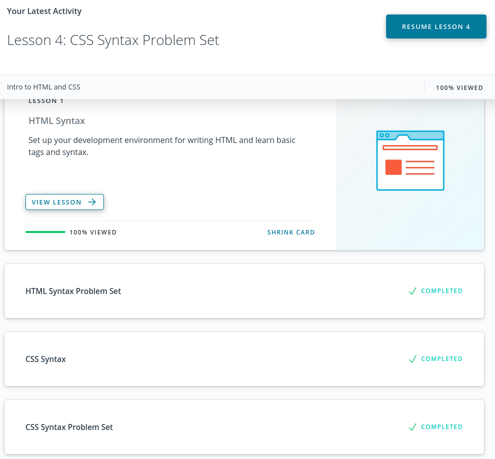

# [kottans-frontend](https://github.com/kottans/frontend)

## General
1. [Git and GitHub](#git-and-github)
2. [Linux CLI and Networking](#linux-cli-and-networking)
3. [VCS GitHub and Collaboration](#vcs-github-and-collaboration)

## Front-End Basics
4. [Intro to HTML & CSS](#intro-to-html-&-css)
5. Responsive Web Design
6. HTML & CSS Practice
7. JavaScript Basics
8. Document Object Model

## Advanced Topics
9.  Building a Tiny JS World
10. Object oriented JS
11. OOP exercise
12. Offline Web Applications
13. Memory pair game
14. Website Performance Optimization
15. Friends App

***
### Git and GitHub:

<a href="https://www.udacity.com/course/version-control-with-git--ud123">Version Control with Git</a>

 

<a href="https://learngitbranching.js.org/">Learn Git Branching</a>

 

 

### Linux CLI and Networking

<a href="https://linuxsurvival.com/">Linux Survival </a>

 

### VCS GitHub and Collaboration

<a href="https://classroom.udacity.com/courses/ud456/">GitHub & Collaboration</a>

 

<a href="https://learngitbranching.js.org/">Learn Git Branching</a>

 

 

### Intro to HTML & CSS

<a href="https://www.udacity.com/course/intro-to-html-and-css--ud001#/">Intro to HTML and CSS</a>

 

<a href="https://www.codecademy.com/learn/learn-html">Learn HTML</a> & 
<a href="https://www.codecademy.com/learn/learn-css">Learn CSS</a>

 

